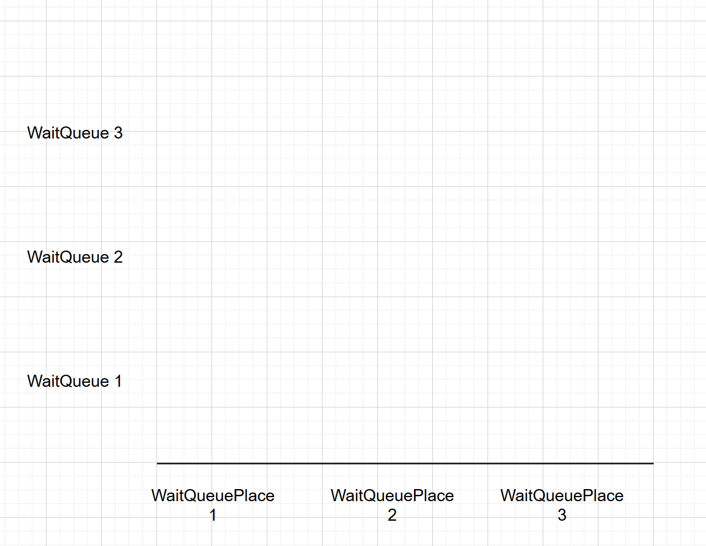
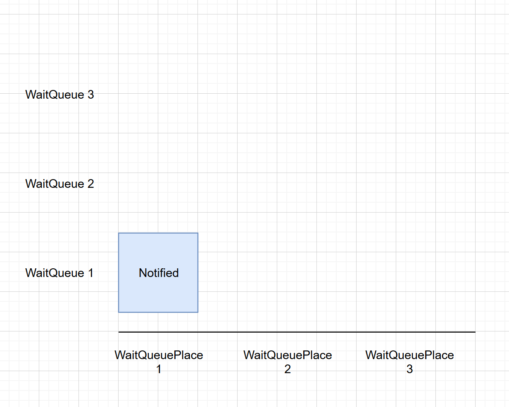
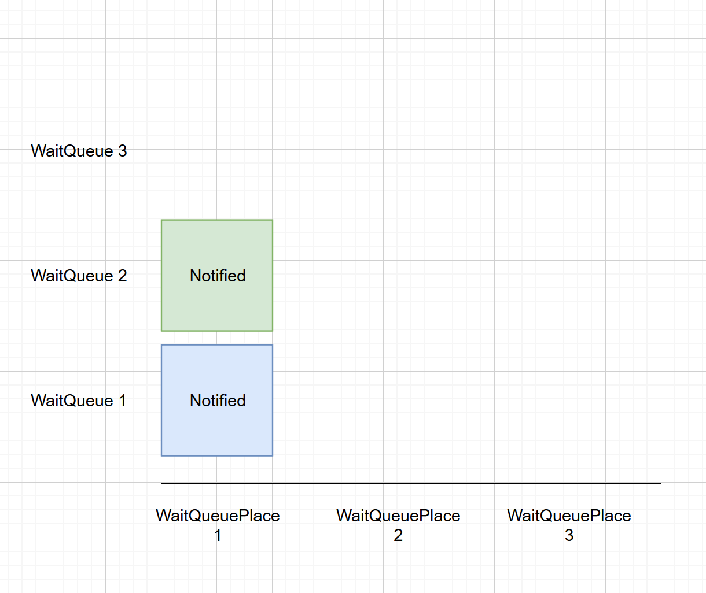
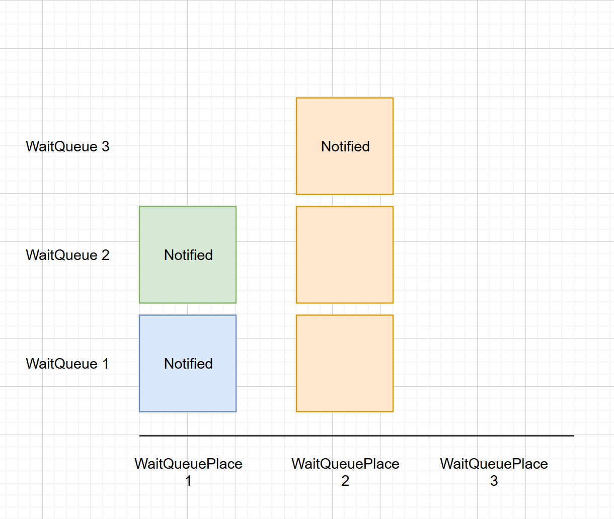
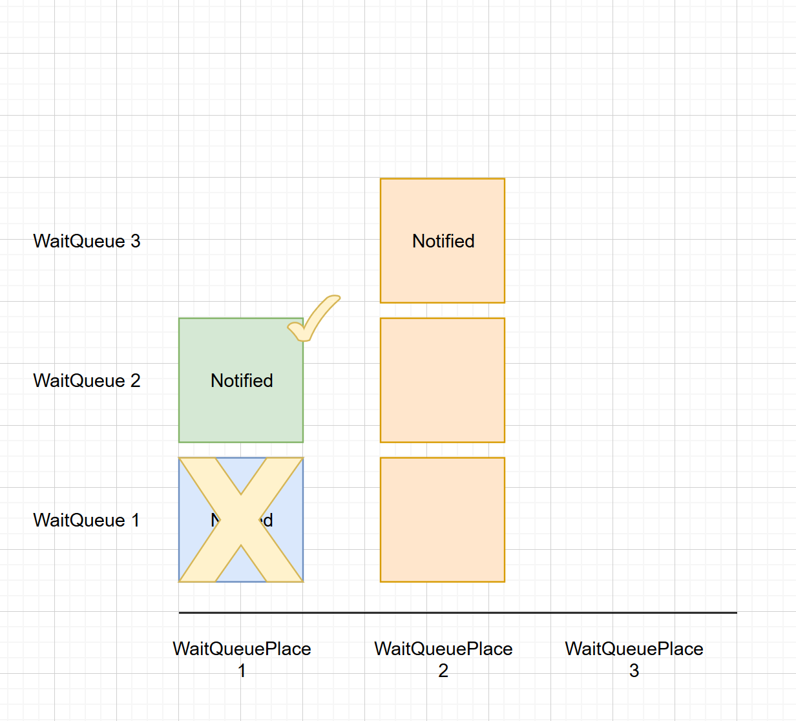
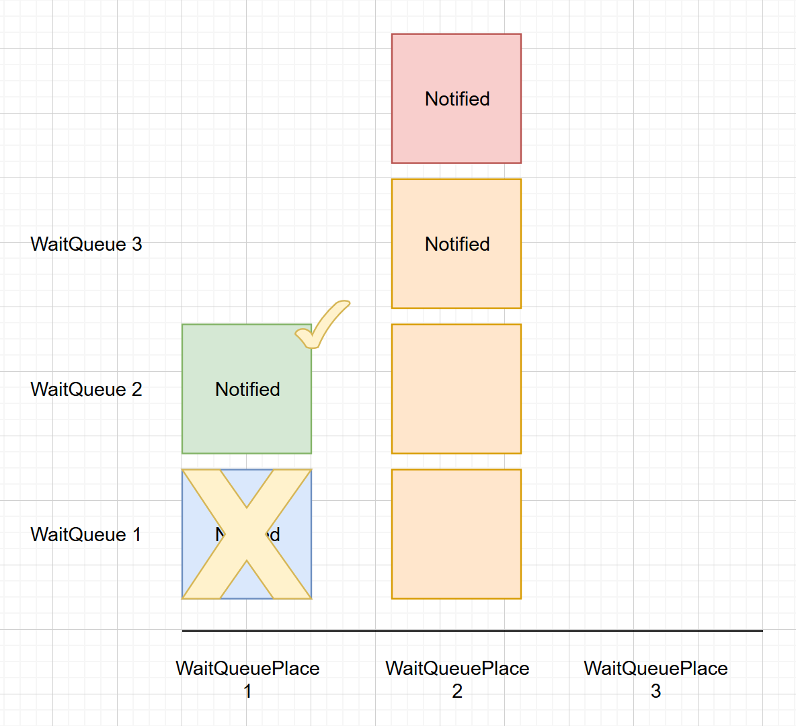
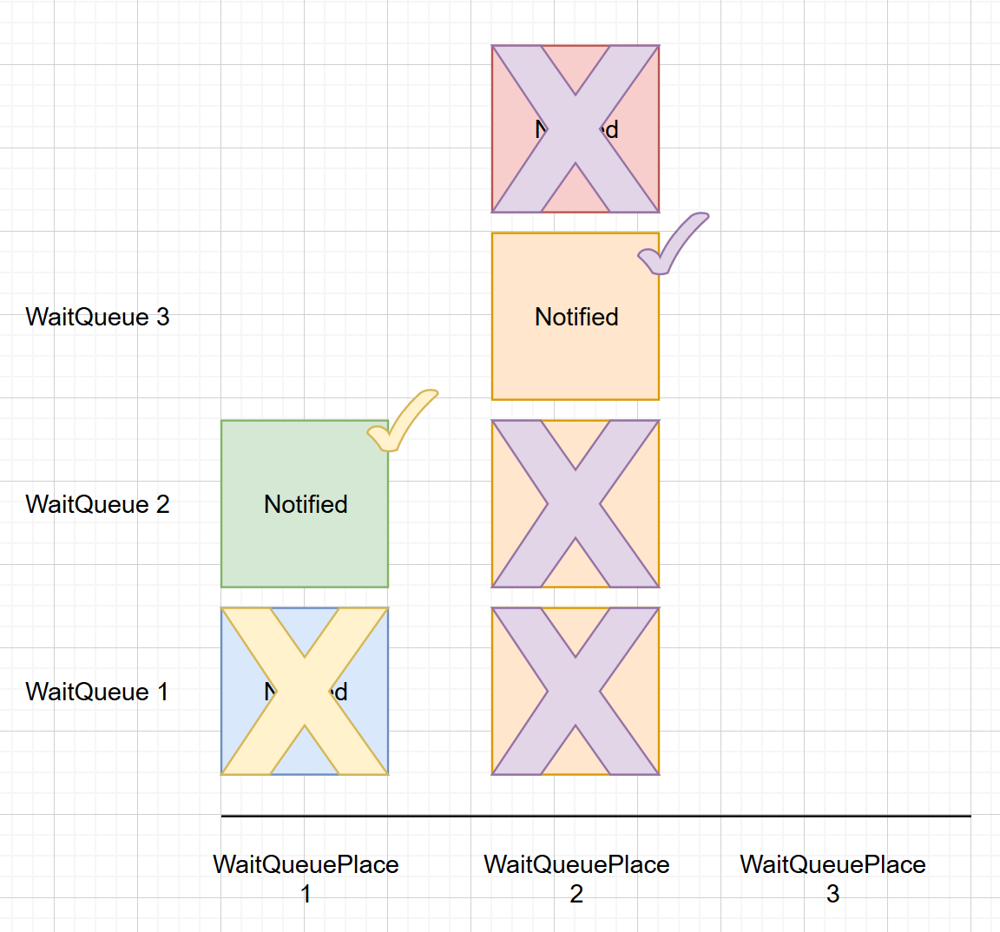
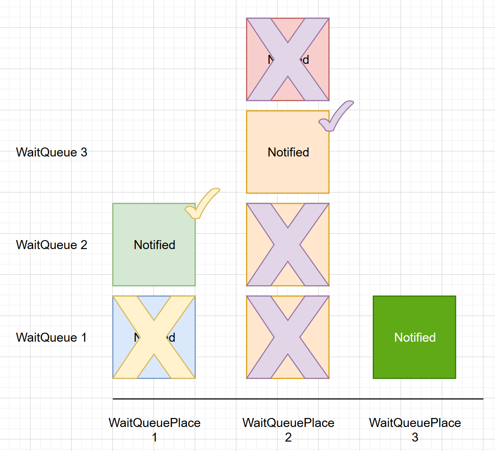

This document is here to illustrate the wait queue functionnality of the system.

## Terminology

| Term                          | Definition
|------------------------------ |--------------------------
| **WaitQueue**                 | A wait queue is waiting place of a user for the specific retreat. WaitQueues are ordered by creation date (first in, first out)
| **WaitQueuePlace**            | A WaitQueuePlace is a retirement place available for waiting people. Each time a new WaitQueuePlace is created, the system will begin notify people in order to fill it and find a new customer.
| **WaitQueuePlaceReserved**    | A WaitQueuePlaceReserved is kind of a ticket authorization that we give to waiting people to say that they have the right to fill a WaitQueuePlace. The system create WaitQueuePlaceReserverd each 24h for the next customer in line.

## Process

### Initialisation

At the beginning, there is nothing.

We can see on the left the WaitQueue (people in queue) and on the bottom the new place that we need to fill.

### A reservation is cancelled

When a reservation is cancelled, the system will automatically create a first WaitQueuePlace in order to notify waiting people and find a new customer.

Here we can see that the first user has automatically been notified, he now have a WaitQueuePlaceReserved

### Nothing new, time fly

If the first user in queue (WaitQueue 1) don't buy the retirement's place available for him, the system automatically notify the second user in queue in order to find a customer motivated with the product.

Here we can see that the second user has automatically been notified, he now have a WaitQueuePlaceReserved

NB: At this step, both users can reserve the WaitQueuePlace and fill the empty seat of the retirement. The second user need to be fast if he don't want to be notified for nothing.

### A second reservation is cancelled

Let's imagine that a second reservation is now cancelled:

 - The first WaitQueuePlace is not filled for the moment
 - A second WaitQueuePlace is created and we need to find a customer
 - User 1 & 2 are already notified that they are allowed to buy a place

Since there is no reason to re-notify user 1 & 2, the system will automatically notify the third user.

NB: We can see that we create WaitQueuePlaceReserved for user 1 & 2 but without notification (ie: emails) to allow us to reserve the second place but without being spammed with out notification.

### User 2 reserve a place

Now, let's see what's going on if user 2 want to reserve a place to the retirement:

 - The first WaitQueuePlace is now filled
 - WaitingQueuePlaceReserved for user 1 on place 1 is now unavailable

Since user 1 has already been notify at the beginning and that he is always authorize to reserve a place, there is no need to notify him.

NB: At this step we now have only one place available for waiting user.

### Notification interval is done

After the notification interval (24H), what will be the next step for the automatic system ? :

 - Only one WaitingQueuePlace is available (#2)
 - User 1 & 3 are already notified
 - User 2 is already participant on the retirement
 - We will notify the next user on queue (user 4)

We are exactly in the same case as when we notified user 2 for the WaitingQueuePlace 1.

### User 3 reserve a place

Now, let's imagine we are on a good day and user 3 reserve a place (24H):

 - The second WaitQueuePlace is now filled
 - WaitingQueuePlaceReserved for all users of WaitingQueuePlace2 are now unavailable

Since there is no more place available, the waiting queue is just stopped until a new reservation will be cancelled

### An other reservation is cancelled

If a new retirement cancellation occur:

 - A new WaitingQueuePlace is created (as always)
 - A WaitingQueuePlaceReserved is created for user 1 
 - User 1 is notify since he have now a new chance to reserve a place
 
This step is kind of a new beginning since all the users lost their right to reserve a place before. We need to re-notify all of them, one by one.

